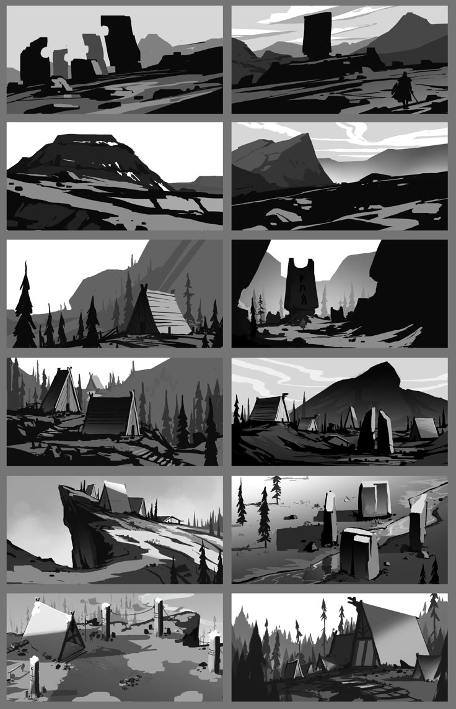

# 第一章 剪影观察与整体性

## 1.1 什么是剪影观察？
剪影观察是一种绘画方法，它强调对象的外形轮廓和整体结构，而非内部细节。通过将对象视为一个二维的黑色剪影，艺术家可以更好地理解其比例、动态和空间关系。

<!-- 在此处插入剪影观察的原理图，例如：有细节 vs 无细节的对比图 -->
 

<!-- 示例： -->

## 1.2 整体性在绘画中的重要性
整体性是指将画面中的所有元素视为一个统一的整体。在绘画过程中，从整体出发，把握大局，避免过早陷入细节，是创作出和谐、有力的作品的关键。剪影观察正是培养整体性思维的有效途径。

<!-- 在此处插入整体性构图的原理图，例如：元素如何构成整体的示意图 -->

<!-- 示例： -->

## 1.3 如何进行剪影观察
1.  **眯眼观察：** 稍微眯起眼睛，模糊掉对象的细节，只关注其大的形状和明暗关系。

2.  **简化轮廓：** 用简单的线条勾勒出对象最基本的外形，忽略不必要的复杂性。
3.  **寻找负空间：** 观察对象周围的负空间（背景或空隙），它们同样能帮助你确定对象的形状和位置。
4.  **比较与调整：** 不断比较不同部分之间的比例和关系，确保整体的协调性。

<!-- 在此处插入剪影观察步骤的原理图，例如：眯眼观察、简化轮廓、负空间、比较调整的示例图 -->
<!-- 示例： -->

## 1.4 剪影观察在不同绘画题材中的应用
*   **角色设计** 快速捕捉人物的动态和姿态。

*   **场景设计** 简化复杂的自然景观，把握山川、树木的宏大轮廓。
 
*   **静物画：** 确定物体组合的整体形态和空间布局。

<!-- 在此处插入剪影观察在不同题材中应用的示例图，例如：人物速写、风景画、静物画的剪影示例 -->

<!-- 示例： -->

## 1.5 练习建议
*   **剪影练习：** 尝试用黑色马克笔或炭笔，在短时间内画出对象的剪影。
*   **大形概括：** 在开始详细描绘之前，先用大笔触或粗线条概括出对象的整体形状。
*   **定期退远观察：** 在绘画过程中，经常退后几步，从远处审视作品，检查整体效果。

<!-- 在此处插入剪影练习的原理图，例如：剪影练习、大形概括、退远观察的示例图 -->
<!-- 示例： -->
